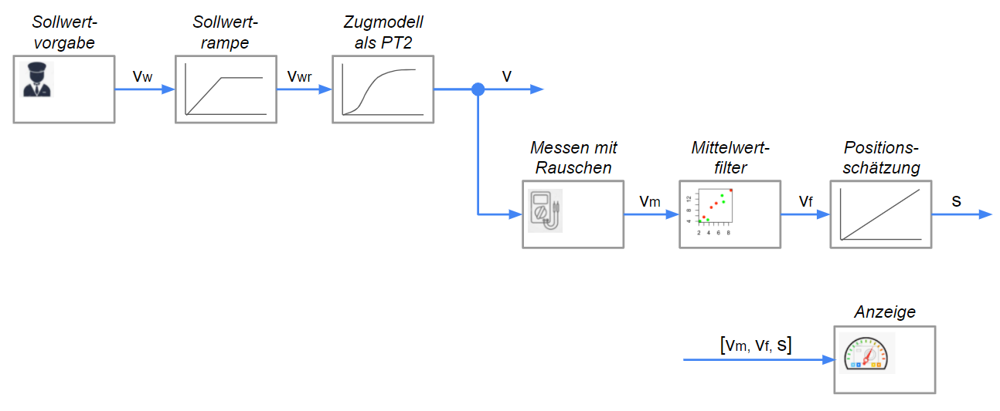
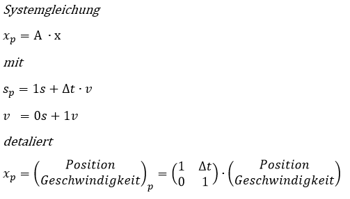
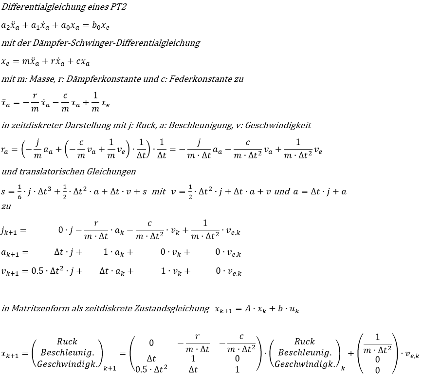
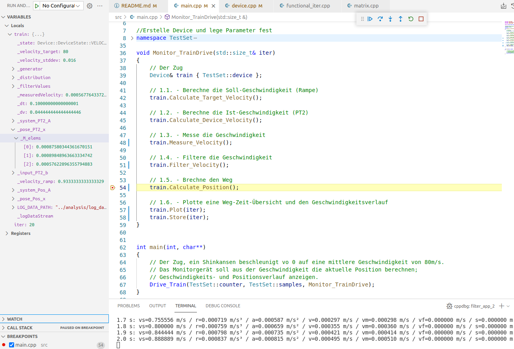
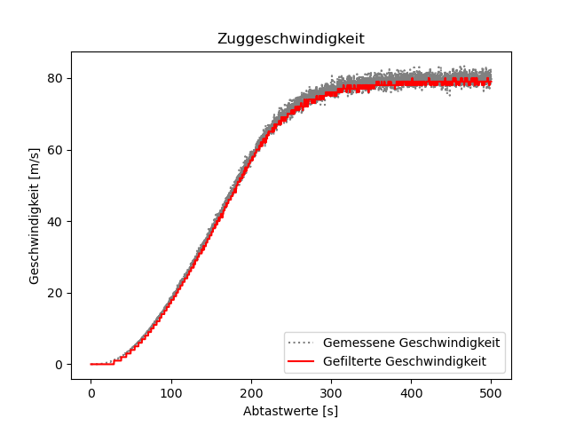
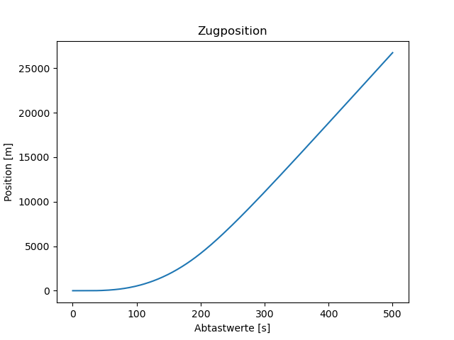
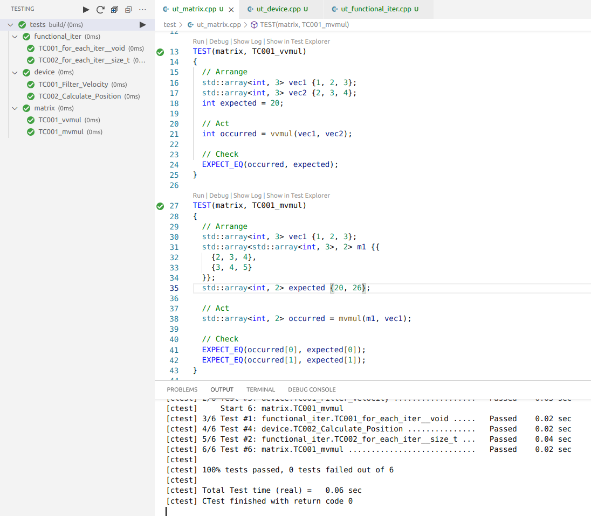
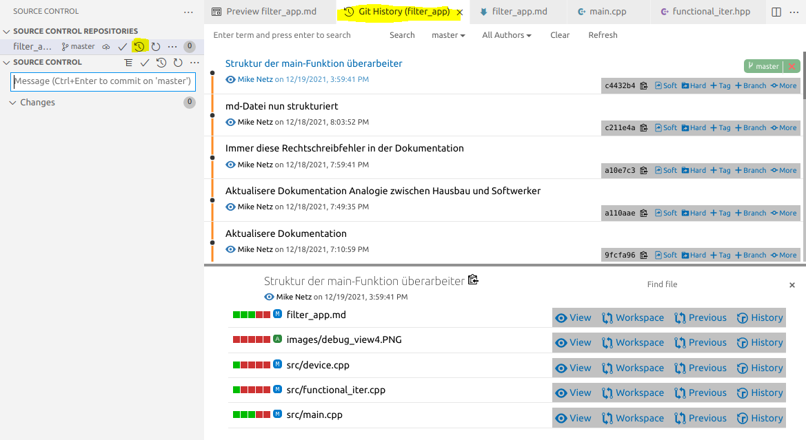

# Den Weg eines Fahrzeugs aus seiner Geschwindigkeit ermitteln

Im ersten Projekt **Train-Measurement** fuhr der Zug mit einer festen Geschwindigkeit von 80m/s. In diesem Projekt startet der Zug aus dem Stillstand und beschleunigt dann auf die Sollgeschwindigkeit von 80m/s.

## 1. Blockschaltbild des Geräts

<br>



<br>

## 2. Entwicklungsschritte

Entwicklungsschritte sind:
-	2.1. Formuliere die Idee mittels Blockschaltbild (BSB)
-	2.2. Erstelle ein C++-Projekt in Visual Studio Code
-	2.3. Schreibe die einzelnen [Arbeitsschritte](#link3) des BSD auf
-   2.4. Deklariere die [Schnittstelle](#link4)
-   2.5. Definiere die [Funktionsrümpfe](#link5) und rufe die Schnittstelle auf
-   2.6. Definiere alle [Funktionen](#link6)
-   2.7. Definiere zu jeder Funktion ein Unit-Test
-	2.8. Dokumentation (Dateien und md-Datei) abschließen

<br>

### <span id="link3">2.3. Schreibe die einzelnen Arbeitsschritte des BSD auf</span>

*Wie bei einem Hausbau zeichnet zuerst ein Architekt das Haus. Der Softwerker pinselt ein Blockschaltbild seiner Idee.*

Schreibe den Ablauf des Blockschaltbilds in kommentarform auf:
-   Definere das Testset. 
    -   Ein stehender Zug beschleunigt gemäß Sollvorgabe auf eine Zielgeschwindigkeit Geschwindigkeit.
    -   Ein Messgerät misst die Geschwindigkeit und ermittelt daraus die aktuelle Position. 
-   Die Messung soll 500s mit einer Auflösung von 100ms dauern.
-   Für die Iteration der Abtaswerte soll die "for_each_iter"-Funktion verwendet werden.


Datei main.cpp:
```C++
//...

#define Drive_Train for_each_iter

//Erstelle Device und lege Parameter fest
namespace TestSet
{
	// ...
    
    // Das Objekt
    Device device { velocity_target, velocity_stddev, 
                    dt,
                    par_m, par_r, par_c};
    // ...
}

void Monitor_TrainDrive(std::size_t& iter)
{
    // Der Zug
    Device& train { TestSet::device };

    // 1.1. - Berechne die Soll-Geschwindigkeit (Rampe)
    train.Calculate_Target_Velocity();
    
    // 1.2. - Berechne die Ist-Geschwindigkeit (PT2)
    train.Calculate_Device_Velocity();
    
    // 1.3. - Messe die Geschwindigkeit

    // 1.4. - Filtere die Geschwindigkeit

    // 1.5. - Brechne den Weg

    // 1.6. - Plotte eine Weg-Zeit-Übersicht und den Geschwindigkeitsverlauf
}

int main(int, char**)
{
    // Der Zug, ein Shinkansen beschleunigt vo 0 auf eine mittlere Geschwindigkeit von 80m/s.
    // Das Monitorgerät soll aus der Geschwindigkeit die aktuelle Position berechnen;
    // Geschwindigkeits- und Positionsverlauf anzeigen.
    Drive_Train(TestSet::counter, TestSet::samples, Monitor_TrainDrive);
}

// ...
```

<br>

### <span id="link4">2.4. Deklariere die Schnittstelle</span>

*Nun erfolgt der Rohbau. Der Softwerker deklariert die neue Schnittstelle durch Funktionen.*

Datei matrix.hpp:

```C++
// ...

// Vektoraddition: Vektor + Skalar
template <typename T, std::size_t SIZE>
std::array< T, SIZE> vsadd(std::array< T, SIZE> v, T s);

// Vektoraddition: Vektor 1 + Vektor 2
template <typename T, std::size_t SIZE>
std::array< T, SIZE> vvadd(std::array< T, SIZE> v1, std::array< T, SIZE> v2);

// ...
```
<br>

Datei device.hpp:

```C++
// ...

class Device final
{
public:
    using filter_array = std::array<double,10>;

    enum struct DeviceState
    {
        UNDEFINED,
        INITILIZED,
        TARGET_VELOCITY_CALCULATED,
        ACTUAL_VELOCITY_CALCULATED,
        VELOCITY_MEASURED,
        VELOCITY_FILTERED,
        POSITION_ESTIMATED,
        PLOTTED
    };

    // Initialisiere das Gerät
    Device(double velocity_target, // m/s
           double velocity_stddev, // %
           double dt,			   // s
           double par_m,
           double par_r,
           double par_c);
    
    // Berechne die Soll-Geschwindigkeit (Rampe)
    double Calculate_Target_Velocity();
    
    // Berechne die Ist-Geschwindigkeit (PT2)
    double Calculate_Device_Velocity();

    // Messe die Geschwindigkeit
    double Measure_Velocity();

    // Filtere die Geschwindigkeit
    double Filter_Velocity();

    // Brechne den Weg
    double Calculate_Position();

    // Plotte eine Weg-Zeit-Übersicht und den Geschwindigkeitsverlauf
    void Plot(std::size_t& iter);
    
    // Siche die Daten in einer Datei
    void Store(std::size_t& iter);

private:
    Device() = delete;

    DeviceState _state { DeviceState::UNDEFINED };
};

// ....
```

<br>

### <span id="link5">2.5. Definiere die Funktionsrümpfe und rufe die Schnittstelle auf</span>

*Der Rohbau schreitet voran. Der Softwerker definiert die Schnittstellen-Funtionen durch Funktionsrümpfe.
Jede Funktion setzt einen Zustand. Die Funktionen werden in der "Main"-Funktion geordnet aufgerufen*

*Nun wird der Rohbau abgenommen. Der Softwerker testet den korrekten Aufruf der neuen Schnittstelle mittels der Zustände im Debugger.*

Datei device.cpp:

```C++
// ...

double Device::Calculate_Target_Velocity()
{
    _state = DeviceState::TARGET_VELOCITY_CALCULATED;
    return 0.0;
}

double Device::Calculate_Device_Velocity()
{
    _state = DeviceState::ACTUAL_VELOCITY_CALCULATED;
    return 0.0;
}

// ....
```
<br>

Datei main.cpp:

```C++
// ....

#define Drive_Train for_each_iter

//Erstelle Device und lege Parameter fest
namespace TestSet
{
    // Testgerät
    constexpr double speed_mean { 80.0 };  // m/s
    constexpr double speed_stddev { 8.0 }; // m/s
    constexpr double dt { 0.1 };    // 100ms
    Device device {speed_mean, speed_stddev, dt};
    
    // Testlauf
    constexpr double time { 10.0 }; // 10s
    constexpr std::size_t samples { static_cast<uint32_t>(time / dt) };
    std::size_t counter { 0 };
}


void Monitor_TrainDrive(std::size_t& iter)
{
    // Der Zug
    Device& train { TestSet::device };

    // 1.1. - Messen die Geschwindigkeit
    train.Measure_Velocity();

    // 1.2. - Filtere die Geschwindigkeit
    train.Filter_Velocity();

    // 1.3. - Brechne den Weg
    train.Calculate_Position();

    // 1.4. - Plotte ein Weg-Zeit-Übersicht
    train.Plot(iter);
}

int main(int, char**)
{
    // Der Zug, Shinkansen fährt konstant mit einer mittleren Geschwindigkeit von 80m/s.
    // Das Monitorgerät soll aus der Geschwindigkeit die aktuelle Position berechnen und anzeigen.
    Drive_Train(TestSet::counter, TestSet::samples, Monitor_TrainDrive);
}

// ...
```
<br>

### <span id="link6">2.6. Definiere alle Funktionen</span>

*Beim Innausbau erstellt jedes Gewerk seine Einrichungen, der Installateur verlegt die Fussbodenheizung, der Elektriker die Kabel. 
Analog impementiert der Softwerker seine Funktionen*

Die Implementierung der neuen Schnittstelle erfolgt in kompakter funktionsorientierter Form, für Schleifen werden Funktionen gewählt - siehe Beispiele:

Datei matrix.hpp

```C++
// ...

// Vektoraddition: Vektor 1 + Vektor 2
template <typename T, std::size_t SIZE>
std::array< T, SIZE>  vvadd(std::array< T, SIZE> v1, std::array< T, SIZE> v2)
{
    static_assert(v1.size() == v2.size(), "The vectors are not the same size.");

    std::array<T, SIZE> result { 0 };

    for(std::size_t i = 0; i < v1.size(); i++)
    {
        result[i] = v1[i] + v2[i];
    }

    return result;
}

// ..
```

<br>
Datei device.cpp

Für die Berechnung des PT2s und der neuen Position wird Matrizenberechnung verwendet.

**PT2**
<br>
 

```C++
// ...

double Device::Calculate_Device_Velocity()
{
    // x(k+1) = A * x(k) + b * u(k)
    _pose_PT2_x = vvadd( mvmul(_system_PT2_A, _pose_PT2_x), vsadd(_input_PT2_b, _velocity_ramp) );

    _state = DeviceState::ACTUAL_VELOCITY_CALCULATED;
    return Get_PT2_Velocity();
}

// ...
```

<br>

**Position**
<br>


<br>

```C++
// ...

double Device::Calculate_Position()
{
    // Berechne die neue Position x(p) = A * x
    _pose_x = mvmul(_system_A, _pose_x);

    _state = DeviceState::CALCULATED;
    return Get_Position();
}

// ...
```

<br>

## 3. Debuggen

*Jedes Gewerk prüft seine Einrichtungen, der Elektriker prüft seine Schaltungen, der Softwerker seine Funktionen*
*Deutsches Handwerk kommt von können, nicht von schauen wir mal, basteln wir uns ein Haus* :satisfied:

Debuggen durh die Applikation:



<br>

## 3.1. Messdatenanalyse

Das Programm speichert während des Testlaufs Daten:
-   time
-   jerk (PT2)
-   accelaration (PT2)
-   velocity (PT2)
-   velocity_m
-   velocity_f
-   position

in die Messdatei log_data.csv. Das Python-Script **data_analysis.py** stellt die Daten grafisch dar:







<br>
Der Mittelwertfilter liefert bereits ein brauchbares Ergebnis. :satisfied:

<br>

## 4. Unit-Test

*Am Ende steht die Abhame, der Elektromeister prüft die Isolationswiderstände, der Bauleiter das gesamte Haus.*
*Der Softwerker prüft seine Arbeit durch Unit-Tests.*

Für die Unit-Tests wird GoogleTest verwendet, welches auch durch CTest ausgeführt werden kann.

 

<br>

## 5. Versionsmanagement mit Git

Git hilft einem bei der schrittweisen Entwicklung. Jeder Entwicklungsschritt wird gesichert. Später ermöglicht es einem,
die Entwicklungsschritte besser nachzuvollziehen. Im Fehlerfall kann man leichter auf einem früheren Entwicklungschritte zrückwechseln.



<br>

## 6. Fazit und Ausblick

Mit dem Wechsel zur Objekorientierung wurden funtionale Aufrufe weiter abstahiert, die allgemeinere "for_each_iter"-Funktion zeigt es deitlich.
Es ergibt sich eine bessere Kohäsion zwischen den Geräte-Parametern und den darauf angewendeten Geräte-Funktionen.

<br>

## Licence
This project is licensed under the terms of the [](https://opensource.org/licenses/MIT)

<br>
